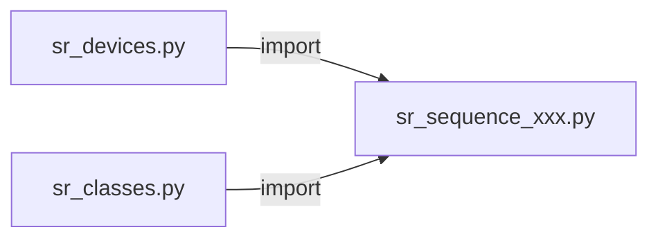

## Structure

The goal for this repository is to be structured in a similar way to the code for the Rb experiment written by Deon.
This means that there are two files `sr_devices.py` and `sr_classes.py` that contain respectively instructions on how to connect to devices and contain classes like `MOT` or `TweezerLoading` for example, that can be imported in the experimental sequence files `sr_sequence_xxx.py` where `xxx` denotes the experiment name. 

In this way, the main file is less cluttered. 

## Roadmap

The following things are required from the Artiq side on running a blue MOT:

* AOM control
    1. Zeeman slower.
    2. 2D MOT/deflector.
    3. 3D mot
    4. Repump lasers 
* Magnetic field control
* Triggering the MOT camera. 